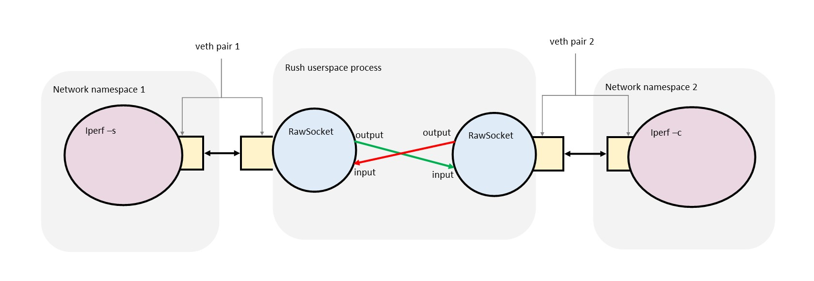

# Intro

- Big picture goal: we want to simulate flaky networks for testing. We’ll call
  those _synthetic networks_.

- Intermediate goal: we want to make it really easy to write simple code that
  messes with network packets going from A to B.
  
- Hand-wavy plan: we’ll use Linux functionality to grab packets and pull them
  out of its networking stack, and create a userspace program that does
  something to those packets before inserting them back into the Linux
  networking stack

## Oh look what happens to be lying around

Once upon a time I worked with people to help network operators scratch their
own itches. We made this open source toolkit called
[Snabb](https://github.com/snabbco/snabb) that let’s people write super fast
packet processing applications in a high level language (Lua).

### Skip this section unless you are in the mood for story time

> In case the last paragraph sounds wacky to you, that’s because it _is_ a
> little bit, but please suspend your disbelief for a bit while I build up my
> story arc.
>
> Backstory: packet networking in Linux has been historically slow. In the
> context of a general purpose OS where most userspace applications communicate
> via TCP sockets it’s not bad at all. However, if you are a telecommunications
> company, and you really only care about Ethernet/IP then using
> socket(2)/send(2)/recv(2) syscalls to do your business is *glacial*.

> The reasons for this are twofold: one is that Linux being a general purpose
> OS tries to support many different usecases and has to solve a lot of
> problems in a single stack (…, routing, packet reassembly, TCP), and two is
> architectural (let’s just start with system calls are actually fairly
> expensive due to context switching).
>
> Snabb breaks the problem down into something simple:
> 
> 1. we manage a bunch of flat buffers that will hold our packet data
> 2. we write our own network card drivers that slurp each packet from the
>    wire *directly* into one of those flat buffers
> 3. we hand the filled buffers to our application which mutates the packets
>    in-place
> 4. we hand the mutated packet buffers back to our device driver which puts
>    the data on the link
>
> Because this is comparatively simple, and everything runs in a single
> userspace process, we can process millions of packets per second this way on
> a single CPU core.
>
> Still don't believe me? Nowadays Linux is adding features such as XDP which
> is trying to do pretty much the same. End of story time.

### Snabb in Rust

Last year I ported the essentials of Snabb to Rust, mostly to learn Rust and
see if I like it. I called the project [Rush](https://github.com/eugeneia/rush)
(_Snabb_ means “fast” in Swedish). I propose to reuse that project for the
*userspace program that does something to packets* part of our plan.

If your *over-engineering* alarm bells are ringing, I sympathize, but hear me
out: besides the Rust synergy with other projects at Daily, the major reason
I’m considering Rush instead of Snabb is size. Rush has all the essentials of
Snabb that make it easy to poke at packets, but none of the
serious-real-world-telco-applications stuff. Pinky swear: it’s only about
1,000 LoC you have to worry about in the context of what we’re trying to do.

Still, there are some concepts to know. Rush has a [screencast
series](https://mr.gy/screen/rush/) where I journal the implementation, but
that is riddled with my commentary on getting to know Rust. Luke has written
some brief primers that apply to Rush:

 - [Snabb Switch in a Nutshell](https://github.com/lukego/blog/issues/10)
 - [Snabb data structures: packets, links, and apps](https://github.com/lukego/blog/issues/11)
 - Not relevant to us right now, but for the curious: [Snabb Switch: kernel-bypass networking illustrated](https://github.com/lukego/blog/issues/13)

> I promise to produce a guide that gets you started on the sort of things we
> want to do using Rust/Rush examples in the coming weeks.

Code that can be safely ignored and deleted:

 - `src/ixy*`: this a device driver for Intel 10G Ethernet NICs, we won't be
   using that anytime soon
 - `src/memory.rs`: this a DMA-capable memory allocator that’s only interesting
   when we run hardware drivers like the ixy one above (I've already patched
   the code so that nothing in that file will even run)
 - `checksum.rs`: the fastest IP checksum implementations for x86 and aarch64
   under the sun (okay I'm just boasting now, but it's unlikely we’re gonna'
   need that) 
 - `header.rs`, `ethernet.rs`: this stuff will only get interesting when we
   start to parse packets

That leaves us with…

```
$ wc -l src/basic_apps.rs src/config.rs src/engine.rs src/ethernet.rs src/header.rs src/lib.rs src/link.rs src/main.rs  src/packet.rs
   82 src/basic_apps.rs
   94 src/config.rs
  574 src/engine.rs
  118 src/ethernet.rs
   43 src/header.rs
   49 src/lib.rs
  118 src/link.rs
   92 src/main.rs
  164 src/packet.rs
 1334 total
```

…around one KLoc including tests. Pinky-swear kinda kept.

# Proof of Concept

To test the waters I have ported the `RawSocket` from Snabb over to Rush. This
is the bit that let’s us pull packets out of arbitrary Linux network interfaces
and push the back into the same or other interfaces once we're done with them.

I also wrote a little test case (`vethtest.sh`, and `src/main.rs:main`) that
should roughly prove we can do what we set out to do.



The test case creates two pairs of `veth` interfaces, and puts one end of each
pair into two separate fresh network namespaces. This way we can switch into
one of the namespaces and be sure packets don't get routed via other interfaces
present on the host (coincidentally, this is also how container networking
works as far as I know). Let’s call these isolated interfaces *A* and *B*.

We then start our userspace process which opens the two ends of the `veth`
pairs that are left outside of the freshly created network namespaces as raw
sockets, and forwards packets arriving on one interface to the other and
vice-versa.

The result should be that the two interfaces *A* and *B* in the newly created
network namespaces should have connectivity. (If the userspace forwarder is
*not* running, packets sent on *A* should not arrive on *B* and vice-versa.)

Let’s take a quick peek how this simple forwarder looks in Rush:

```rust
// Handle command line arguments: the names of two Linux interfaces
if args.len() != 3 {
    println!("Invalid number of arguments.");
    println!("Usage: {} <ifname1> <ifname2>", &args[0]);
    process::exit(1);
}
let ifname1 = &args[1];
let ifname2 = &args[2];

// Create a new empty configuration
let mut c = config::new();

// Configure two RawSocket apps (“if1” and “if2”),
// each connecting to one interface.
// Instances of the RawSocket app have one input port and one output port:
//  - packets arriving on the interface are put on the output port
//  - packets on the input port and sent out through the interface
config::app(&mut c, "if1", &RawSocket { ifname: ifname1.to_string() });
config::app(&mut c, "if2", &RawSocket { ifname: ifname2.to_string() });

// Configure two (unidirectional links) bridging if1 and if2
//  - connect the output of if1 to the input of if2
//  - connect the output of if2 to the input of if1
// This way packets received on the interface <ifname1> will be sent over the
// interface <ifname2> and vice-versa.
config::link(&mut c, "if1.output -> if2.input");
config::link(&mut c, "if2.output -> if1.input");

// Apply the configuration
engine::configure(&c);

// Run the engine in an endless loop, report some stats every second.
loop {
    engine::main(Some(engine::Options {
        duration: Some(Duration::new(1, 0)), // 1 second
        report_links: true,
        report_load: true,
        ..Default::default()
    }));
}
```

To test our setup and evaluate performance we run an `iperf` server on
interface *A* and an `iperf` client trying to send 10 Gbps of UDP on interface
*B*.

```
$ ip netns exec $ns0 iperf -s &
$ ip netns exec $ns1 iperf -c 10.10.0.1 -u -b 10000M
```

## Results

Iperf reports

```
[ ID] Interval           Transfer     Bitrate         Jitter    Lost/Total Datagrams
[  5]   0.00-10.06  sec  3.70 GBytes  3.16 Gbits/sec  0.001 ms  965195/3708358 (26%)  receiver
[  5]   9.00-10.00  sec   520 MBytes  4.36 Gbits/sec  376323
```

and our Rush process process reports

```
load: time: 1.00 fps: 273,891 fpGbps: 3.317 fpb: 102 bpp: 1,490 sleep: 0
Link report:
  21 sent on if1.output -> if2.input (loss rate: 0%)
  2,723,476 sent on if2.output -> if1.input (loss rate: 0%)
```

> Legend:
> - fps: frees per second (roughly translates to packets processed)
> - fpGbps: Gigabits of packet data processed, including Ethernet frame
>   overhead (translates to bits over the physical wire)
> - bpp: bytes per packet (mean packet size)

So it seems we can do something like 3 Gbps and around 300K packets per second
using raw sockets (on one core of a modern 3Ghz desktop CPU). Feels like this
should be good enough for what we’re set out to do?

## How to reproduce

If you clone this repository you can reproduce my results as follows (on Linux):

 - If you use [Nix](https://nixos.org/) you can do `nix-shell` in the project
   root to drop into a shell with all dependencies present.
 - Otherwise the `default.nix` at least helpful in the sense that it lists all
   dependencies under `buildInputs`. Currently that’s rustc/cargo from the rust
   nightly release 2020-04-08 (newer probably works too), and iperf (2 or 3
   shouldn’t matter)
   
You can build the project with

```
$ cargo build --release
```

and run the tests with

```
$ cargo test --release
```

If you've build the project you should be able to run

```
$ sudo ./vethtest.sh
```

to reproduce the PoC. WARNING: I would personally only recommend to do that on
dedicated test boxes or VMs. `sudo` aside, the script at least tries to clean
up after itself but its messing with network interfaces so…

Also, please excuse the noisy output, at this points it really just dumps the
output of like ten different commands of which some run concurrently.


### Boast

The test below pretty much does the same thing as our `vethtest.sh` only
without Linux in the middle. Shows you that it really is a high performance
design and gives an idea of the relative overheads involved.

```
$ RUSH_BASIC1_NPACKETS=100e6 cargo test --release -- tests::basic1 --nocapture
...
Processed 100.1 million packets in 3.68 seconds (rate: 27.2 Mpps).
```

# Thoughts

So while this isn’t exactly what we’re looking for I think it gives us some
confidence on a few fronts:

 - first thing next week I’ll stuff some clumsy bits between the two
   `RawSocket` apps and drop some packets, which we will be able to observe
   with `ping` or `iperf`; it will look something like this:
   
```rust
// App network:
//               v---clumsyIngress---.
// client1 <-> if1                   if2 <-> client2
//               `---clumsyEgress----^
config::app(&mut c, "if1", &RawSocket { ifname: ifname1.to_string() });
config::app(&mut c, "if2", &RawSocket { ifname: ifname2.to_string() });

config::app(&mut c, "clumsyIngress", &Clumsy {});
config::app(&mut c, "clumsyEgress", &Clumsy {});

config::link(&mut c, "if1.output -> clumsyIngress.input");
config::link(&mut c, "clumsyIngress.output -> if2.input");

config::link(&mut c, "if2.output -> clumsyEngress.input");
config::link(&mut c, "clumsyEngress.output -> if1.input");


// Clumsy app (network function) would do something like:
let p = link::receive(input)
if p.length % 2 == 0 {
    link::transmit(output, p); // forward packets with even size
} else {
    packet::free(p) // drop packets with odd size
}
```

 - we’re not container yet, but as long as we can make a client try to reach IP
   address X over an interface of our choosing we can proxy those packets to an
   an application listening on IP address X on a different interface, and I
   feel like that should cover our use case?
