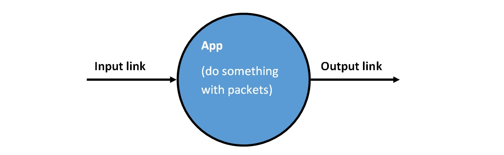
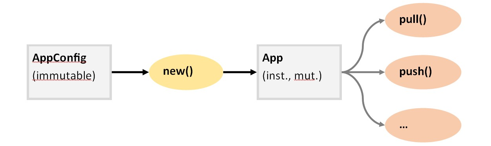
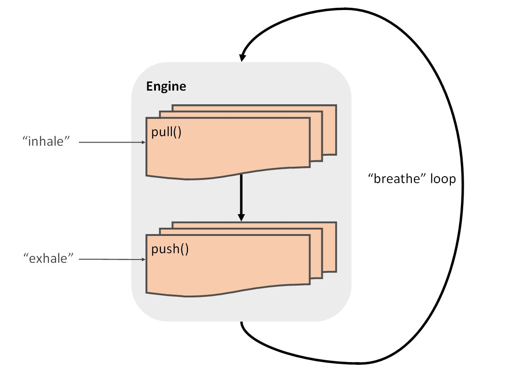
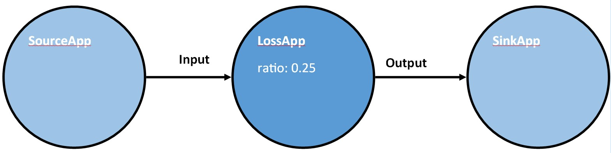

# How to write a Rush app

Let’s say we want to add a reusable component that allows us to simulate
probabilistic packet loss, say to simulate a flaky link that drops 17% of the
packets going over it, at random.

I’ve done that by writing the [qos::Loss](https://github.com/daily-co/synthetic-network/blob/ab83b56cd1f39a919fd6c2ab010584661d82648e/src/qos.rs#L11-L38)
app, and I’ll go over the implementation here in detail and hopefully explain
everything you need to know to write your own apps.

## Boilerplate

The file `qos.rs` starts out by including three modules that form the heart of
our little packet processing toolkit.

```rust
use super::packet;
use super::link;
use super::engine;

// QoS: quality of service regulating apps
…
```

- `packet` manages a pool of packets and exposes functions for allocating,
  releasing, and mutating packets.
  
- `link` implements a simple ring buffer that we use to transfer packets
  between components. Links act as single-producer/single-consumer queues, and
  emulate unidirectional wires. The module exposes functions for checking if a
  link is empty or full, and pushing packets onto the link or popping them off
  at the other end.
  
- `engine` puts the “frame” into “framework”. It glues together all our
  components to act in symphony, end exposes the interfaces and conventions we
  need to implement to stay in “tune”.
  
### Vendoring dependencies

```rust
…

use rand::Rng;

// Loss app: simulate probabilistic packet loss
…
```

The component we’re about to write drops packets at random, so we’re going to
need some source of entropy. In Rust, that seems to be provided by the `rand`
crate which we currently do not depend on. I think it’s suave to vendor (fancy
word for “copy”) as many dependencies as possible directly into the project
repository, and so that’s how it’s done in Rush.

To add a new crate dependency this is what I do:

1. find the crate I want on [docs.rs](https://docs.rs/), in this case
   [rand](https://docs.rs/rand/0.8.3/rand/) which is currently at version
   `0.8.3`
   
2. I edit `Cargo.toml` and add `rand = "0.8.3"` under `[dependencies]`

3. I then run `cargo vendor` in the project root to fetch the source code and
   put it into the `vendor/` directory (this automagically updates `Caro.lock`
   in the project root)

4. finally, I commit all changes in `vendor/` and the changes in `Cargo.toml`
   and `Cargo.lock` with a message like “vendor rand 0.8.3”

## Actually writing an App

So what’s an *app*? Apps are how we organize the components in our packet
processing program. Apps can have any number of input and output links, and do
something to packets. To form a program we typically instantiate a bunch of
different apps and connect with each other using links (packet queues). We call
the resulting graph an *app network*.



The engine helps us some with setting up our app network and expects us to
follow some conventions in return. To make an instance of an app you create an
immutable bit of plain old data which we call the `AppConfig` and pass it to a
function `new` which will return an app instance. The app instance is a bit of
possibly mutable state—which we call just `App`—upon which the actual behavior
of the component will operate.



The idea here is to have a clear split of declarative stuff
(setup/configuration) and app behavior (code that runs for every packet, many
many times each second). I realize I’m leaving a lot of loose ends here, but
bear with me, this’ll hopefully all somewhat make sense at the end of this
report.

For our `qos::Loss` this setup looks as follows:

```rust
// Loss app: simulate probabilistic packet loss

// This is the immutable plain-old-data we use to configure an app instance.
// (Configuration data must implement the Clone and Debug traits, consider this
// an implementation detail.)
#[derive(Clone,Debug)]
pub struct Loss {
    // ratio 0..1 of dropped packets (0.0 → 0%, 0.5 → 50%, 1.0 → 100%)
    pub ratio: f64
}

// Here we implement new() for our Loss app
//
//  - implement the trait (eqv. to interface) engine::AppConfig for our
//    plain-old-data config object `Loss'
//
//  - the AppConfig trait is really just one function:
//      new(<AppConfig>) -> <App>
//
//  - Box<dyn engine::App> is Rust arcana for “pointer to an object of any type
//    as long as it implements the App trait
//
impl engine::AppConfig for Loss {
    fn new(&self) -> Box<dyn engine::App> {
        // Here we prepare the app instance
        // This is a boring example because we just copy the only field `ratio'
        // from the config to the instance. At least we can sanity check the
        // configuration.
        assert!(self.ratio >= 0.0 && self.ratio <= 1.0,
                "Ratio must be within 0.0 and 1.0");
        // Any preparation of instance-specific state (data-structures,
        // computed values, …) we need when running the app would happen here.
        // Finally, return a LossApp instance.
        Box::new(LossApp {ratio: self.ratio})
    }
}
```

> Ok phew… pretend this is all sane for a little bit longer!

With the setup off the table, let’s nail down the app behavior. The trait
`engine::App` describes app behavior and proposes a few functions we might want
to implement: `pull()`, `push()`, `report()`, and `stop()`.

BUT WHY?!



Ok, let’s ignore `report()`, and `stop()` for now as they’re not immediately
useful to us, but I’m gonna’ at least explain enough of how the Rush engine
works for `pull()`, `push()` to make sense.

So this engine? It runs in a loop, which we call the “breathe loop”. On every
iteration it does the following *in order*:

1. Calls the `pull()` functions of all configured app instances (to “inhale”
   packets into the engine)
   > By (configurable) convention, we inhale ~100 packets at a time: this is a
   > tradeoff between latency and amortizing work over reasonable batches of
   > packets (CPU uarchs, caches, performance, blah blah…)

2. Calls the `push()` functions for configured apps that have new packets on
   any of their input links (to “exhale” packets out of the engine)
   
So to decide what should be done in `pull()` or `push()`:

 - `pull()` pulls packets into the app network (or engine); when we
   insert packets from an external source like a device driver, or our
   `RawSocket` app that grabs packets from a Linux interface, or when we
   synthesize packets from thin air we do that in `pull()`
   
 - `push()` processes packets and passes them on to the next app, or pushes
   them out of the app network (onto the real network; i.e., a wire, or in our
   case the Linux networking stack); so pretty much anything that doesn’t fit
   into `pull()` we do in `push()`
   
Ok, so on to our app’s behavior:

```rust
// LossApp is the app’s instance object.
// Yes, it’s exactly the same as the config in this case. SORRY!
pub struct LossApp { ratio: f64 }

// Implement the engine:App trait for LossApp…
impl engine::App for LossApp {

    // We do our thing in push(): we push packets through the engine,
    // just not all of them. ;-)
    // We have to tell the engine that we implement push() by
    // overriding has_push()
    fn has_push(&self) -> bool { true }
    
    // push() is passed the app instance, as well as an AppState object
    // through which we can access the app’s links
    fn push(&self, app: &engine::AppState) {
    
        // Borrow mutable references the input link named "input" and the
        // output link named "output"
        //  - we have to borrow them because they are owned by the engine and
        //    Rust is super strict about making sure only one place in code
        //    mutates a given region of memory at any time
        //  - we call unwrap() because get() here returns either Option<link>
        //    or None if no link by the specified name exists (if either
        //    "input" or "output" doesn’t exist, this app will crash and burn,
        //    see rawsocket_app.rs for how to handle missing links gracefully)
        let mut input = app.input.get("input").unwrap().borrow_mut();
        let mut output = app.output.get("output").unwrap().borrow_mut();
        
        // Grab a RNG we can use to get entropy
        let mut rng = rand::thread_rng();
        
        // OK, BUSINESS!
        // While our "input" link is not empty we loop and…
        // (If you remember the comment above on inhale batch size: on a loaded
        // system there will be ~100 packets on each input link every time
        // push() is called)
        while !link::empty(&input) {
        
            // Pop the next packet off the link
            let p = link::receive(&mut input);
            
            // Roll the dice, generate a random floating point value
            // “uniformly distributed in the half-open range [0, 1)”
            // (meaning, never 1.0)
            if rng.gen::<f64>() >= self.ratio {
                // If its greater or equal to our configured ratio
                // we forward the packet by transmitting it
                // onto the "output" link
                link::transmit(&mut output, p);
            } else {
                // Otherwise, we drop the packet by freeing it
                packet::free(p);
                // (if you forget to free a packet, Rush will crash instantly;
                // meaning this is not like malloc/free where you end up with a
                // memory leak, so don’t worry)
            }
        }
    }
}
```

### What if I want to interact with packet contents?

Packets are represented as a very simple data structure:

```rust
// The maximum amount of payload in any given packet.
pub const PAYLOAD_SIZE: usize = 1024*10;

pub struct Packet {
    pub length: u16, // data payload length
    pub data: [u8; PAYLOAD_SIZE]
}
```

So you can just poke them at will:

```rust
let p = link::receive(&mut input);

if p.length < 14 {
    // something is very, very wrong
}

if p.data[12] == 0x08 && p.data[13] == 0x00 {
    // this is an IPv4 packet!
}
```

If you want to change packet data you have to remember to declare the variable
holding the packet as mutable:

```rust
let mut p = link::receive(&mut input);

if p.length > 100 {
    // Truncate the packet after 100 bytes
    p.length = 100;
}
```

For a more structured approach to parsing packets you can look at
`ethernet.rs`:

```rust
use super::header;
use super::ethernet::Ethernet;

let mut p = link::receive(&mut input);
let mut eth = header::from_mem::<Ethernet>(&mut p.data);
if eth.ethertype() == 0x0800 {
    // This is an IPv4 packet!
    // Let’s swap the Ethernet src and dst addresses for no reason!
    eth.swap();
    // And on you go!
    link::transmit(&mut output, p);
} else {
    packet::free(p);
}
```

## Testing our new App

We’re gonna’ write a cool test case for the `Loss` app, and the arcane
`AppConfig`/`new()` dance I forced you through will make sense and seem less
insane, I promise!



We will write a little Rush program-as-a-testcase that uses some
batteries-included apps from the `basic_apps` module, and the `config` module.
We’ll daisy-chain the following two basic apps to our `Loss` app:

- `basic_apps::Source`: this app synthesizes empty fake packets (pulls test
  traffic into the app network) on all its output links
  
- `basic_apps::Sink`: this app just silently discards all the packets it
  receives on any of its input links

The `config` module is used like so:

- `config::new()` creates a new empty configuration

- `config::app()` adds an app instance

- `config::link()` declares a link between two app instances

- `engine::configure()` takes a configuration and applies it to the engine
  (makes it real!)
  
- `engine::main()` runs the applied configuration (chews through packets)


```rust
// Rust has a useful way of adding tests modules, looks like dis:
#[cfg(test)]
mod selftest {

    // Inherit imports from the qos module
    // Also import config and basic_apps modules
    use super::*;
    use crate::config;
    use crate::basic_apps;

    use std::time::Duration;

    // Our test case!
    #[test]
    fn loss() {
    
        let loss_rate = 0.25;
    
        // Create a new empty configuration
        let mut c = config::new();
        
        // Declare a Source app instance named "source" that will synthesize
        // 60 byte packets
        config::app(&mut c, "source", &basic_apps::Source {size: 60});
        
        // Declare an instance of our loss app named "loss" that will drop
        // loss_rate of all packets
        config::app(&mut c, "loss", &Loss {ratio: loss_rate});
        
        // Declare a Sink app instance
        config::app(&mut c, "sink", &basic_apps::Sink {});
        
        // Declare a link from the "output" port of "source" to the "input"
        // port of "loss"
        config::link(&mut c, "source.output -> loss.input");
        
        // Declare a link from the "output" port of "loss" to the "input"
        // port of "sink"
        config::link(&mut c, "loss.output -> sink.input");
        
        // Apply the configuration
        engine::configure(&c);
        
        // Run the engine for 10 milliseconds, print a link report at the end
        engine::main(Some(engine::Options {
            duration: Some(Duration::new(0, 10_000_000)), // 0.01s
            report_links: true,
            ..Default::default()
        }));
        
        // Inspect the links afterwards to ensure our Loss app works
        // (within tolerance)
        let input = engine::state().link_table
            .get("source.output -> loss.input").unwrap();
        let output = engine::state().link_table
            .get("loss.output -> sink.input").unwrap();
        let sent = input.borrow().txpackets as f64;
        let received = output.borrow().rxpackets as f64;
        
        // loss should be pretty close to loss_rate
        let loss = 1.0 - received/sent;
        println!("Loss = {:.1}%", loss * 100.0);
        let tolerance = 0.01;
        assert!((loss - loss_rate).abs() < tolerance);
    }
}
```

After we [import](https://github.com/daily-co/synthetic-network/blob/ab83b56cd1f39a919fd6c2ab010584661d82648e/src/main.rs#L17)
the `qos` module into `main.rs`, we can run the test case like so
(`--nocapture` causes the Rust test runner to not hide its output):

```
$ cargo test --release -- qos::selftest::loss --nocapture
…
running 1 test
test qos::selftest::loss ... Link report:
  218,830 sent on loss.output -> sink.input (loss rate: 0%)
  292,026 sent on source.output -> loss.input (loss rate: 0%)
Loss = 25.1%
ok
…
```

And voilà! Seems to work!

> In case you are confused by the `loss rate: 0%` in the link report… fear not,
> these are internal metrics: if an app was producing packets faster that a
> preceding app is able to consume ’em, the packets would jam up on the link
> between them. Links have a fixed capacity, and if it is exceeded then the
> extraneous packets are dropped. Those dropped packets would then show up in
> the link report loss rate to inform the programmer that this is happening.

## Bigger test cases

If you take a look at [main.rs](https://github.com/daily-co/synthetic-network/blob/ab83b56cd1f39a919fd6c2ab010584661d82648e/src/main.rs#L42-L47),
I’ve added two `Loss` app instances between our `RawSocket` interfaces (one for
ingress, one for egress). For now they are just hardcoded to drop 10% of
packets in ingress, and 20% of packets on egress. I’ve also added an optional
bitrate argument to [vethtest.sh](https://github.com/daily-co/synthetic-network/blob/ab83b56cd1f39a919fd6c2ab010584661d82648e/vethtest.sh#L6-L7)
so you can test out the new app affects UDP iperf like so:

```
$ cargo build --release
$ sudo ./vethtest.sh 1000M
…
[ ID] Interval           Transfer     Bitrate         Jitter    Lost/Total Datagrams
[  5]   0.00-10.00  sec  1.16 GBytes  1000 Mbits/sec  0.000 ms  0/863198 (0%)  sender
[  5]   0.00-10.05  sec   954 MBytes   796 Mbits/sec  0.003 ms  172572/863198 (20%)  receiver
…
```

> Which checks out: iperf client to iperf server is the egress direction in
> this test case, which we configured to drop 20%

Except sometimes! Sometimes we drop some seemingly important packets that cause
UDP iperf to get confused and time out? :D
