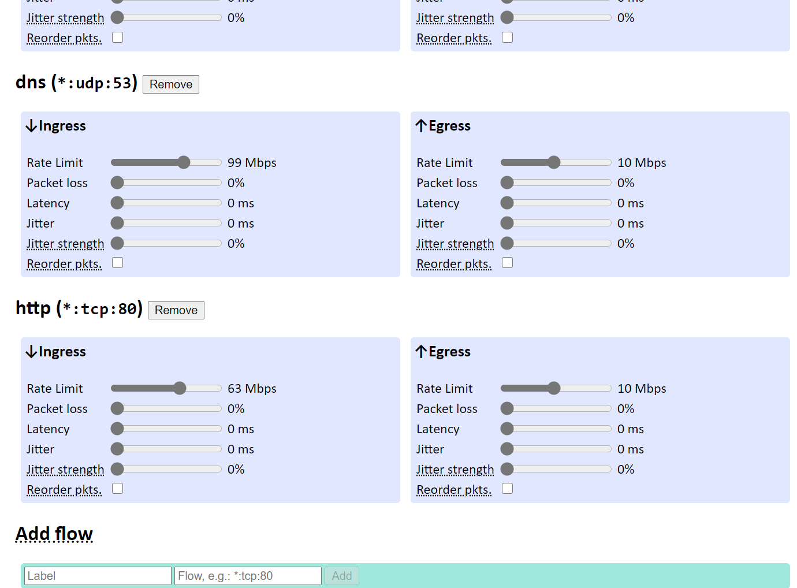
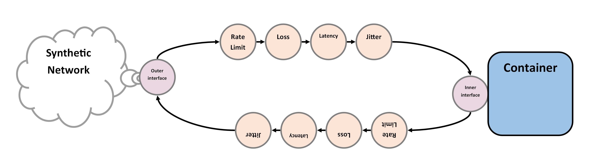
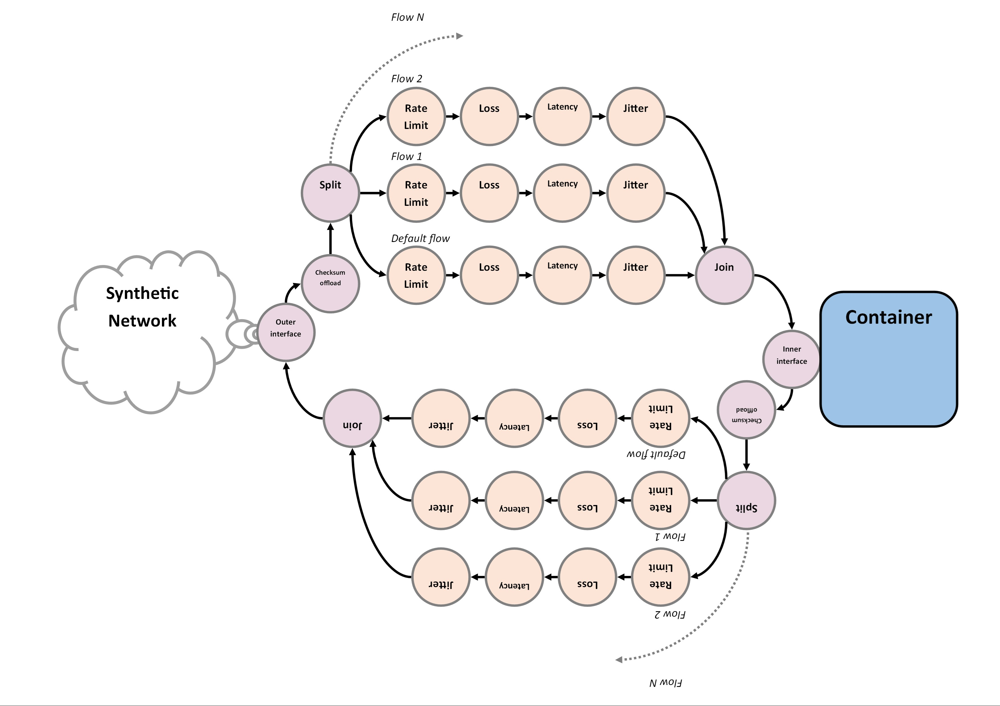

# Network flows

We did some work on protocol header parsing that let’s us apply distinct
quality of service settings for individual “flows” in addition to the “default
flow”. Packets that do not match any flow will be routed through the default
flow.

We defined a flow to be a `(address, protocol, portrange)` tuple, where
`address` and `portrange` refer to the source address/port fields for traffic
coming into the container (ingress) and the destination address/port fields
for traffic going out of the container (egress). Any field in the tuple can be
a wildcard.

For example, the tuple `(10.0.0.1, *, 80)` would match any traffic between the
container and port 80 on the host `10.0.0.1`.

We also updated the Web UI to let you add and remove flows and adjust their
individual quality of service settings:



In the Web UI you specify flows using a simple DSL of the form

```
<address>[:<protocol>[:<port_min>[-<port_max>]]]
```
where `protocol`, `port_min`, and `port_max` can be omitted or wildcarded using
`*`. Some examples:

> HTTP traffic - *:tcp:80
> (0.0.0.0:tcp:80 is equivalent)
> 
> All TCP traffic  - *:tcp
> (equivalent to *:6 and *:tcp)
> 
> All traffic to 10.0.0.1 - 10.0.0.1:*
> (equivalent to just 10.0.0.1)
> 
> UDP traffic on ports 1-1000 - *:udp:1-1000
> 
> DNS - *:udp:53
> 
> Flow labels have the form: [a-zA-Z0-9_]+
> The label “default” is reserved.

## Caveats

- In the synthetic network configuration flows are modeled as a list, and their
  **ordering matters**! The userspace proxy attempts to match a packet each
  flow in order and chooses the first one that matches.
  
- Currently, we only support IPv4 flows. IPv6 packets end up on the default
  flow.
  
## Implementation



The app network for the `synthetic_network` program used to be as pictured
above. I.e., there was one chain of traffic conditioning apps for the
ingress/egress paths respectively. In order to support multiple flows with
separate quality of service settings we extended the graph as shown below.



The new [Split](https://github.com/daily-co/synthetic-network/blob/main/rush/src/flow.rs#L16-L101)
app does the heavy lifting, parsing protocol headers and
distributing packets to its output links accordingly. At each of its outputs
there sits a dedicated chain of traffic conditioning apps that can be
configured to implement the flow’s quality of service settings.

### Parsing protocols

The way we parse network protocol headers is to overlay packed `struct`s at
bespoke offsets in the packet payload. You can take a peek at *ethernet.rs*,
*ipv4.rs*, *tcp.rs*, and *udp.rs* to see how the protocols we parse are encoded
on the wire. I suppose one way to solve parsing is to define your languages to
be regular enough to hardly need any parsing. :-)

Below’s the definition of the UDP header. You can easily figure out how we can
tell which destination port a packet is intended to go to from that.
Admittedly, UDP is the simplest of the IETF protocols, and that’s why it’s my
favorite protocol, too. Will you look at that? Beautiful!

```rust
#[repr(C, packed)]
#[derive(Default)]
pub struct UDP {
    src_port: u16,
    dst_port: u16,
    len: u16,
    checksum: u16
}
```

## Bonus: Checksums

We ~~nipped #5 in the bud~~ fixed a checksum offload interoperability issue with Linux (at least for IPv4) by reviving `checksum.rs` and adding the
[Checksum](https://github.com/daily-co/synthetic-network/blob/main/rush/src/offload.rs#L15-L96)
app.

That app opportunistically detects packets where Linux omitted to calculate
their checksums and fills those in. No more TCP or UDP errors due to wrong
checksums that take a network pro to debug!

# Chrome on a Synthetic Network with its Head sticking out of VNC

To make the fruits of our labor easily consumable we added a `Makefile` to the
top-level of the repository. That `Makefile` should make one hopefully useful
tool for ad-hoc testing trivially available to Daily hackers: a [Chrome browser
with configurable synthetic network exposed over
VNC](https://github.com/daily-co/synthetic-network#run-chrome-using-synthetic-network-in-vnc).
To try that you can:

> Setup the synthetic network (you only need to do this once)
```
$ make create-synthetic-network # Once-only
export SYNTHETIC_NETWORK=10.77.0.0/16
docker network create synthetic-network --subnet=10.77.0.0/16
5e5f430c9eeb6e36b2440af0a749c32392133cf5d157a4e6fdb0266511fe0e33
```

> Run Chrome in a container (may take a bit to build the containers on the
> first run)
```
$ make run-chrome
...
📺 Point your VNC client at localhost:5901
...
```

You should then be able to point a [VNC client](https://tigervnc.org/) at
`localhost:5901`, and get a Chrome window showing the Synthetic Network Web UI.
Using that browser, you can join meetings and mess with its network to observe
behavior that depends on averse network conditions.


## Under the hood

You can take a peek at [synth-chrome/Dockerfile](https://github.com/daily-co/synthetic-network/blob/main/synth-chrome/Dockerfile)
to see how we build the Chrome container. In a nutshell:

- We build a `syntheticnet:vnc` image with VNC enabled, see `make image-vnc`.
  This is the base Synthetic Network container image which runs the Synthetic
  Network proxy and Web UI and reads the `ENTRY` environment variable for
  what to do next.
  
- We derive an image `FROM syntheticnet:vnc`, install Chrome in there, and set
  `ENTRY` to the humongous command that we use to start Chrome.
