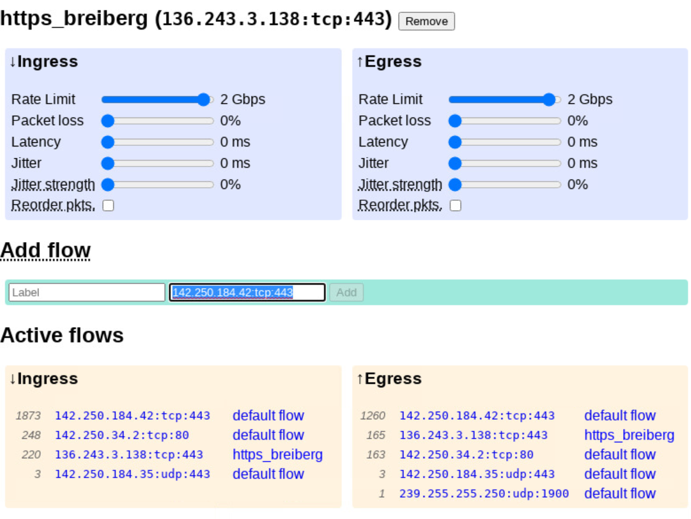
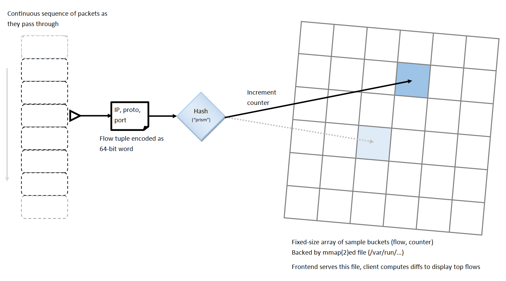

# Traffic profiles

During our little [presentation at engreering all-hands](../report3/synthetic-network-allhands.pdf)
someone (attr.) mentioned they would like to have a monitoring overview of
active traffic added to the web UI.

That turned out to be a really good idea. The web UI now has a listing of
active flows from the last five seconds, ordered by the number of packets seen
on that flow during that period. While being quite bare-bones at this point,
this already gives some neat observability of what’s actually happending on
the network.



As a bonus you can click the listed flow tuples to quickly add a new flow
matching the traffic, and a third column in the monitor shows the label
of the flow rule that matches the traffic so you can quickly tell which
sliders affect the obsered network activity.

## Implementation

(See the [flow::Top app](https://github.com/daily-co/synthetic-network/blob/main/rush/src/flow.rs#L104-L263))

The way this is implemented is that the Synthetic Network backend—our
userspace packet forwarding engine—maintains profiles counting all the packets
it sees on its ingress and egress paths. These profiles are then exposed by
the frontend via HTTP at

 - `/top/ingress.profile`
 - `/top/egress.profile`



The profiles themselves are fixed-size binary files that currently consist of
N=2048 slots, each slot being a pair of 64-bit words. The first word being a
counter counting the number of packets counted in the slot, and the second word
being the packed flow tuple of the last flow counted in the slot.

```rust
const FLOWTOP_NSLOTS: usize = 2048;

#[repr(C, packed)]
struct FlowTop {
    slots: [FlowCtr; FLOWTOP_NSLOTS]
}

#[repr(C, packed)]
struct FlowCtr {
    counter: u64,
    id: u64
}

fn flow_id(ip: u32, protocol: u8, port: u16) -> u64 {
    ((port as u64) << 48) | ((protocol as u64) << 32) | ((ip as u64) << 0)
}
```

To select which slot to count a particular packet in its packed flow tuple
is hashed to select a slot at random. While lightweight, the design is thus
imprecise:

- collisions in profile slots are expected, and cause counts to be
  misattributed
- the likeliness of collsions can be controlled by scaling N accordingly

The web UI prediodically fetches these profiles and computes diffs between
slots with non-zero counters to estimate a packets-per-second activity
of recorded flows (further limiting the impact of slot collisions).

# Scripting

We’re now also exposing a client library useful for scripting synthetic
network conditions in tests. The library gives you a `SyntheticNetwork` class
which you can instantiate for a frontend endpoint via

```js
new SyntheticNetwork({hostname: host, port: port})
```

and that’ll return a object for interfacing with the frontend.
The `SyntheticNetwork` class lets you do anything you can do via the web UI:

- inspect the current configuration
- adjust quality of service and update the configuration
- add and remove flows
- fetch and parse traffic activity profiles

```js
const SyntheticNetwork = require('synthetic-network/frontend')

const synthnet = new SyntheticNetwork({hostname: "localhost", port: 3000})

await synthnet.get() // Get current configuration

// Double ingress rate
var current_ingress_rate = synthnet.default_link.ingress.rate()
synthnet.default_link.ingress.rate(current_ingress_rate*2)

await synthnet.commit() // Apply new configuration

// Add a flow
synthnet.addFlow('udp', {protocol: 'udp'})
synthnet.flows.udp.link.ingress.rate(500000)
synthnet.flows.udp.link.egress.rate(500000)
synthnet.flows.udp.link.egress.loss(0.01)
await synthnet.commit()

// Print ingress traffic statistics
const ingress_profile = await synthnet.profiles.ingress.get()
for (var flow in ingress_profile.flows)
  console.log(flow, ingress_profile.flows[flow].packets)

// ...
```

For a complete example of scripting the synthetic network you can take a look
at [frontend/udp_rate_sine_demo.js](https://github.com/daily-co/synthetic-network/blob/main/frontend/udp_rate_sine_demo.js).
